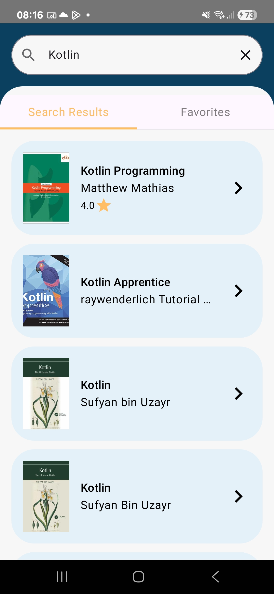

# Bookpedia
Bookpedia is an Kotlin Multiplatform Compose Application created using Jetpack compose

## Result

|  |  |
|----------------------------|:------------------------------------:|

## Tech stack & Open-source libraries
- [Kotlin](https://kotlinlang.org/) based
- [Room](https://developer.android.com/kotlin/multiplatform/room) for local storage. 
- [Coroutines](https://kotlinlang.org/docs/reference/coroutines-overview.html) for asynchronous.
- [JetPack](https://developer.android.com/jetpack)
    - [Compose](https://developer.android.com/jetpack/compose) - Modern toolkit for building native UI.
    - [Lifecycle](https://developer.android.com/topic/libraries/architecture/lifecycle) - Create a UI that automatically responds to lifecycle events.
    - [Navigation](https://developer.android.com/jetpack/compose/navigation) - Handle everything needed for in-app navigation.
    - [ViewModel](https://developer.android.com/topic/libraries/architecture/viewmodel) - UI related data holder, lifecycle aware.
    - [Flow](https://developer.android.com/kotlin/flow?hl=pt-br) - Handle asynchronous data streams in a lifecycle-aware way.
- [Koin](https://insert-koin.io/docs/quickstart/android/) - For [dependency injection](https://developer.android.com/training/dependency-injection/hilt-android).
- [Ktor](https://ktor.io/docs/client-create-new-application.html) - Ktor HTTP request